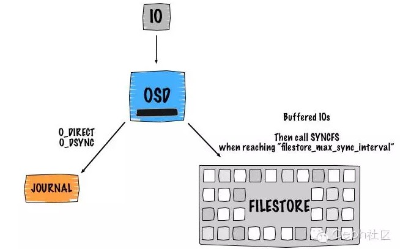

# Ceph Journal

## 简介

与一般的日志文件系统类似，Ceph OSD的日志也是一种事务日志。它是基于文件系统的OSD的关键组成部分，提供存储系统
所需的一致性保证。

Ceph OSD使用日志有两个原因([CephDocument](http://docs.ceph.com/docs/jewel/rados/configuration/journal-ref/))：

1.速度：日志使得Ceph OSD Daemon进程能够快速的提交小IO。Ceph将小的随机IO顺序地写入日志，让后端文件系统有更多
时间来合并IO，提升系统的突发负载能力。然而，这可能带来剧烈的性能抖动，表现为一段时间内的高速写入，而这之后
一段时间内没有任何写入直至文件系统追上日志的进度

2.一致性：Ceph OSD Daemon进程需要一个文件系统接口来保证多个操作的原子性。TODO

dio: 指定了dio后，在FileJournal的_open函数中会指定用`O_DIRECT|O_DSYNC`方式打开journal文件

O_DIRECT: 直接IO，IO高速缓存开销最小化，会降低性能
O_DSYNC: 告诉内核，当向文件写入数据的时候，只有当数据写到磁盘上时，才算写入完成

Problem:
Journal机制使得一次写请求在OSD端变为两次写操作(同步写journal，异步写object)

Ceph有一个原则，就是所有存储的不管是块设备，对象存储还是文件存储，最后都转化成了底层的对象Object，这个Object
包含3个元素，data、xattr和omap。data就是保存对象的数据；xattr是保存对象的扩展属性，每个对象文件都可以设置文件
的属性，这是属性是一个Key/Value值对，但是受文件系统的限制，Key/Value对的个数和每个value的大小都进行了限制。
如果设置的对象的Key/Value不能存储在文件的扩展属性中，可以使用omap来保存。omap实际上是保存到了key/value值对
的数据库leveldb中，在这里的value值限制要比xattr中好的多。

日志写入流程：

日志写入的入口函数为：journal的submit_entry函数

1.通过`writeq_lock`和`completions_lock`首先把请求加入到writeq和completions两个队列中

2.FileJournal的内部线程`write_thread`，对应的run函数`write_thread_entry`从writeq队列中获取请求，通过aio写入
日志磁盘

3.`write_finish_thread`(这里分析aio情况)检查是否有aio请求完成，如果完成，则把请求从completions队列删除，并添加到
Finisher队列里

4.Finisher队列调用日志的回调函数完成

日志的同步：

在FileStore::mount方法中，会创建sync线程 sync_thread.create()，该线程的入口函数为：void FileStore::sync_entry()

该函数定期执行同步操作，当同步时，调用tp.pause使FileStore的op_wq的线程池停止，等待正在应用的日志完成。然后调用fsync
同步内存中的数据到数据盘，当同步完成后，就可以丢弃相应的日志，释放相应的日志空间。

### Journal机制分析

### 模块调试方法

### 数据结构

### 接口、架构

### 流程

### 并发机制

### 参考链接

[Ceph IO模式分析](http://www.openstack.cn/?p=4270)
[Ceph OSD日志分析](http://bbs.ceph.org.cn/article/42)
[Ceph数据存储之路 Object的attr和omap操作](https://my.oschina.net/u/2460844/blog/604530)
[Ceph NewStore存储引擎介绍](https://www.cnblogs.com/wuhuiyuan/p/ceph-newstore-intro.html?hmsr=toutiao.io&utm_medium=toutiao.io&utm_source=toutiao.io)