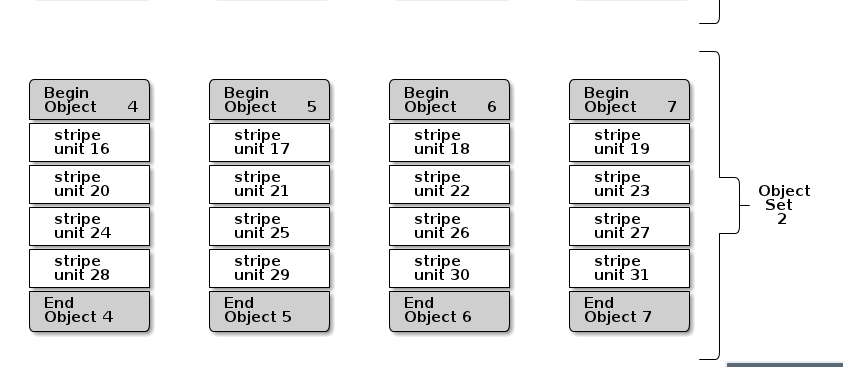

# Ceph学习计划

## 一、熟悉Linux常用命令工具

ps mpstat vmstat free top sar iostat fdisk lsblk df lsscsi mkfs fsck mount umont
blkdiscard htop

## 二、文件系统

### Linux哲学：一切皆文件

### 文件系统体系结构：VFS/XFS/EXT4/Btrfs等

### 文件的存储结构：superblock,inode,dentry

### 了解常见文件操作接口

### 了解fuse,udev等

## 三、IO系统

### iostat,dstat,atop等工具的使用

### 了解IO系统整体结构：通用块层、io调度层、块设备驱动层、SCSI子系统

### 了解Buffered IO、RAW IO

## 四、内存管理

### 物理内存和虚拟内存

### Linux中的伙伴系统

### PageCache和BufferCache

### 掌握内存信息查看命令：free,vmstat

## 五、进程管理

### ps,top,kill,pkill,mpstat命令的使用

### 进程间通信和进程间的同步机制

### 了解LWP

## 六、Linux多线程开发

### 熟悉pthread的相关接口

### 多线程同步机制

### 互斥锁和信号量

## 七、Linux LVM

### 理解LVM中的几个核心知识，PV,VG,LV

### 熟练掌握lvm的常用操作

## 八、了解Linux的集群技术

### 集群分类：高可用、负载均衡和高性能计算

### 了解高可用解决方案：Hearbeat、Corosync、pacemaker

### 了解共享盘技术DRBD

## 九、编程语言

### 精通C/C++

### 熟悉面向对象思维及常见的设计模式

### 熟练掌握Python/Shell

## 十、网络知识

### 熟悉常用的网络编程模型：线程模型、epoll、kqueue

### 掌握常用网络命令：ip,route,ifconfig,ifup,ifdown,netstat,tcpdump

### 理解TCP/IP协议栈

### 了解路由、路由策略

### 了解vlan,vxlan,dns域名解析

### 排查网络性能：iperf

### 了解并能够排查常见网络故障

### 网卡的bind技术

## 十一、分布式存储理论知识

### 熟悉基本概念：节点、通信、副本、异常、可扩展性、一致性

### 数据分布方式：一致性hash

### 副本协议：中心化副本协议、primary-secondary协议以及去中心化副本协议

### 了解Lease机制

### 了解Quorum协议

### 了解两阶段提交协议

### 了解Paxos协议

### 了解MVCC和CAP理论

## 十二、OpenStack知识

### nova

* 熟悉nova的工作流程

* 熟悉ceph的nova driver

* 熟悉nova的常用命令

* 能够通过log定位简单的问题

### cinder

* 熟悉cinder的工作流程

* 熟悉ceph的cinder driver

* 熟悉cinder的常用命令

* 能够通过log定位cinder的问题

### glance

* 熟悉glance的工作流程

* 熟悉ceph的glance driver

* 熟悉glance的常用命令

### keystone

* 了解keystone的工作机制

### neutron

* 了解neutron的整体架构

### manila

* 了解manila的整体架构

* 了解manila的网络结构

### mysql

* 了解常见的数据库操作命令

### 了解nginx和rabbit MQ的工作机制

### 理解UOS系统整体部署架构及网络规划

## 十三、传统存储基础知识

### 磁盘/SSD基础知识及工作原理

### NAS/SAN传统存储协议

### NFS/CIFS/9p协议

### hdparm磁盘故障检测、smartctl的使用

### 容灾和备份

### 了解基本的raid知识

### 了解SCSI协议

## 十四、监控系统

### 能够通过zabbix了解ceph集群的状况

### 熟悉UOS的ceph监控系统Diamond+Carbon+Whisper+Grafana

### 能够通过ceph监控定位ceph的问题

## 十五、虚拟化技术

### 熟悉QEMU/KVM

### 熟悉virtIO

### 熟悉libvirt

### 了解Docker

### 了解cgroup

## 十六、性能分析与调试

### 性能测试工具

* fio,IOzone的使用

* dd

### Linux性能分析工具

* systemtap

* fstrace/strace

* lttng, perf

### ceph性能分析

* ceph -w

* `ceph tell osd.* heap stat`

* `ceph --osd-daemon osd.* dump_historic_ops`

* ceph osd perf

* ceph perf dump

## 十七、Ceph

### ceph核心理论

* ceph架构

* Rados(mon,osd,librados,rados bench性能压测)

* crush算法

* RBD(librbd,krbd,snapshot,RBD应用场景)

* cephfs(mds,libcephfs,cephfs应用场景,cephfs和docker,cephfs和hadoop,cephfs和VDI)

* cephfuse的使用

* RGW(civetWeb,RGW,S3接口,swift接口,对象存储访问场景)

* ceph cache tier和EC

ceph社区

* 尝试向社区提交commit

* 跟进每个release的主要BP

* 积极参与问题的讨论

* 参与社区的研讨会

* 试图将想法转化为BP

### ceph运维

* ceph集群部署初始化

* 常见故障处理

* ceph集群扩容(加磁盘和加节点)

* ceph节点硬件更换

* ceph运维知识的传递

* 集群数据重平衡

### SPDK

### 自动化部署

puppet

* 了解puppet的机制

* 了解puppet-ceph模块

* 能够根据需求对puppet-ceph模块进行修改

ansible

* 熟练使用ansible安装ceph集群

## Ceph知识总结

### 条带化设置



如上图所示：

```paint
stripe_count = 4
```

(也可以表示为1个object set的大小)即并发可顺序写的thread，同时可向4个object写入，提高性能

```paint
stripe_unit = xxx
```

表示每次每块写入的最小单位

```sh
#102400M 大小 strip-unit 65535 byte strip-count 16
rbd create --image-format 2 disk1 --size 102400 --stripe-unit 65536 --stripe-count 16
```

[libradosstriper.cc](https://github.com/ceph/ceph/blob/giant/src/libradosstriper/libradosstriper.cc)
