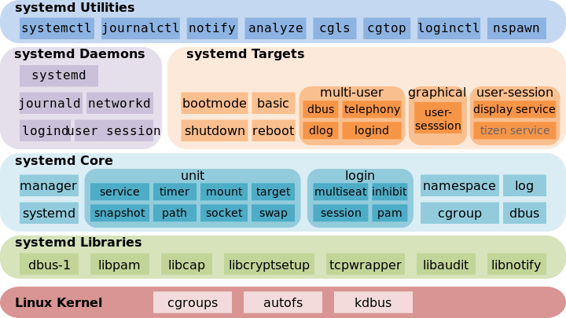

# Cgroup在Ceph中的应用

## 一、为什么在ceph中使用cgroup

可能大家都会有这个疑问，为什么要用cgroup限制ceph的使用资源呢，主要的原因是为了防止在融合架构中ceph占用过多的内存和cpu，
保证整体系统的稳定性。

比如，从CPU的角度来说，monitor和osd都是典型的多线程程序，如果有多个线程都需要相同的数据，那么将这些线程绑定到一个特定的
CPU上是非常有意义的，这样就能确保它们可以访问相同的缓存数据，从而至少能提高缓存命中率，否则的话，这些线程可能会在不同的
CPU上执行，这样会频繁地使其他缓存项失效。但是像ceph这样动不动一个进程就有上百个线程的情况，绑定到一个CPU上或许有些不可
取，一般的做法是一个线程分配一个核，所以在这种情况下，可以为所有的ceph进程分配几个核。

还有就是关于ceph的内存占用，对于IO密集型的应用，cache能加速应用性能，经过测试发现ceph的缓存占用过多，所以需要限制下，
目前给的限制是mon内存1G，缓存4G，osd的内存2G，缓存8G。虽然这样可能会导致ceph的性能降低，但是能保证与其它组件一起稳定
运行。

另外典型的故障就是由于磁盘IO过高导致ceph monitor挂掉，一般情况下非IO密集型的应用占用磁盘IO并不是很高，但ceph的mon是
使用的系统盘，在与openstack的其它组件部署在一起的时候，磁盘IO过高就会导致monitor出现故障。

下面两节就展开介绍cgroup和其使用方法，以及如何在ceph中实际应用cgroup来限制其是用资源，相信通过下面的讲解，你应该可以
将cgroup成功应用到其他地方。

## 二、Cgroup简介

Cgroups是control groups的缩写，是Linux内核提供的一种可以限制、记录、隔离进程/进程组所使用的物理资源（如：CPU, Mem
ory, IO等）的机制。最初由Google的工程师提出，后来被整合进Linux内核。

Cgroups最初的目标是为资源管理提供的一个统一的框架，既整合现有的Cpuset等子系统，也为未来开发新的子系统提供接口。现在的
Cgroups适用于多种应用场景，从单个进程的资源控制，到实现操作系统层次的虚拟化（OS Level Virtualization）。Cgroups提
供以下功能：

1.限制进程组可以使用的资源数量（Resource limiting ）。比如：Memory子系统可以为进程组设定一个Memory使用上限，一旦
进程组使用的内存达到限额再申请内存，就会触发OOM Killer。

2.进程组的优先级控制（Prioritization）。比如：可以使用CPU子系统为某个进程组分配特定CPUshare

3.进程组隔离（Isolation）。比如：使用ns子系统可以使不同的进程组使用不同的namespace，以达到隔离的目的，不同的进程组

有各自的进程、网络、文件系统挂载空间

4.记录进程组使用的资源数量（Accounting）。比如：可以使用Cpuacct子系统记录某个进程组使用的CPU时间

5.进程组控制（Control）。比如：使用freezer子系统可以将进程组挂起和恢复

### cgroup子系统介绍

1.blkio: 这个子系统为块设备设定输入/输出限制，比如物理设备（磁盘，固态硬盘，USB等等）

2.cpu: 这个子系统使用调度程序提供对CPU的Cgroup任务访问

3.cpuacct: 这个子系统自动生成Cgroup中任务所使用的 CPU 报告

4.cpuset: 这个子系统为 Cgroup中的任务分配独立CPU（在多核系统）和内存节点

5.devices: 这个子系统可允许或者拒绝Cgroup中的任务访问设备

6.freezer: 这个子系统挂起或者恢复Cgroup中的任务

7.memory: 这个子系统设定Cgroup中任务使用的内存限制，并自动生成由那些任务使用的内存资源报告

8.net_cls: 这个子系统使用等级识别符（classid）标记网络数据包，可允许Linux 流量控制程序（tc）识别从具体cgroup中生
成的数据包

9.ns: 名称空间子系统

### cgroup使用示例

在CentOS系统中，安装了libcgroup-tools后，就能使用其提供的工具来进行资源限制，另外，CentOS7中使用了systemd来替代之
前版本的sysvinit启动方式，并在system启动脚本中加入了对cgroup的支持，如下图所示：



由于systemd对cgroup的支持并不完善，所以一般还是推荐安装libcgroup-tools来作为临时解决方案，这里我将在systemd中使用
libcgroup-tools来进行测试，实际效果跟使用cgexec的效果是一样的，测试代码如下:

测试内存限制：

```cpp
test.cc

#include <stdio.h>
#include <string>
#include <unistd.h>

using std::string;

int main()
{
    string *str;

    while (true)
    {
        str = new string;
        str->assign(string(BUFSIZ, 'a'));
        ::usleep(10);
    }

    return 0;
}
```

测试CPU占用限制:

```cpp
#include <unistd.h>

int main()
{
    while (true)
    {
        ::usleep(1);
    }

    return 0;
}
```

执行`make test`生成可执行文件

### 使用systemd

systemd启动脚本中加入cgroup资源限制比较简单，目前测试比较好用的是内存限制和CPU使用百分比限制，systemd脚本如下：

```sh
[Unit]
Description=Test Service

[Service]
ExecStart=/root/test
MemoryAccounting=true
MemoryLimit=500M
CPUAccounting=true
CPUQuota=1%
```

使用`systemctl start test`启动进程后，使用`systemctl status test`可以看出，此时进程已经处在cgroup的控制之下，当
前占用的内存为326.9M

```sh
[root@vmware ~]# systemctl status test
● test.service - Test Service
   Loaded: loaded (/usr/lib/systemd/system/test.service; enabled; vendor preset: disabled)
   Active: active (running) since Thu 2016-09-22 16:15:13 CST; 2s ago
 Main PID: 6306 (test)
   Memory: 326.9M (limit: 500.0M)
   CGroup: /system.slice/test.service
           └─6306 /root/test

Sep 22 16:15:13 vmware systemd[1]: Started Test Service.
Sep 22 16:15:13 vmware systemd[1]: Starting Test Service...
```

当进程占用的内存超标以后会触发OOM Killer，此时再用`systemctl status test`查看，如下所示

```sh
[root@vmware ~]# systemctl status test
● test.service - Test Service
   Loaded: loaded (/usr/lib/systemd/system/test.service; enabled; vendor preset: disabled)
   Active: failed (Result: signal) since Thu 2016-09-22 16:15:36 CST; 954ms ago
  Process: 6306 ExecStart=/root/test (code=killed, signal=KILL)
 Main PID: 6306 (code=killed, signal=KILL)

Sep 22 16:15:13 vmware systemd[1]: Started Test Service.
Sep 22 16:15:13 vmware systemd[1]: Starting Test Service...
Sep 22 16:15:36 vmware systemd[1]: test.service: process exited, code=killed, status=9/KILL
Sep 22 16:15:36 vmware systemd[1]: Unit test.service entered failed state.
Sep 22 16:15:36 vmware systemd[1]: test.service failed.
```

另外从`dmesg`中也能看到该进程被kill掉

```plain
[ 9963.177068] Hardware name: VMware Virtual Platform/440BX Desktop Reference Platform
[ 9963.177069]  ffff8800358d5c00 000000009061b3ff ffff880037f73cd0 ffffffff816351f1
[ 9963.177071]  ffff880037f73d60 ffffffff81630191 0000000000000001 ffff880009dc4000
[ 9963.177073]  ffffffff37f73d30 fffeefff00000000 0000000000000001 ffff8800358d6103
[ 9963.177074] Call Trace:
[ 9963.177116]  [<ffffffff816351f1>] dump_stack+0x19/0x1b
[ 9963.177138]  [<ffffffff81630191>] dump_header+0x8e/0x214
[ 9963.177160]  [<ffffffff8116cdee>] oom_kill_process+0x24e/0x3b0
[ 9963.177165]  [<ffffffff81088dae>] ? has_capability_noaudit+0x1e/0x30
[ 9963.177184]  [<ffffffff811d3b05>] mem_cgroup_oom_synchronize+0x555/0x580
[ 9963.177186]  [<ffffffff811d2ef0>] ? mem_cgroup_charge_common+0xc0/0xc0
[ 9963.177188]  [<ffffffff8116d664>] pagefault_out_of_memory+0x14/0x90
[ 9963.177190]  [<ffffffff8162e592>] mm_fault_error+0x8e/0x180
[ 9963.177192]  [<ffffffff816410b1>] __do_page_fault+0x3e1/0x420
[ 9963.177193]  [<ffffffff81641113>] do_page_fault+0x23/0x80
[ 9963.177195]  [<ffffffff8163d408>] page_fault+0x28/0x30
[ 9963.177197] Task in /system.slice/test.service killed as a result of limit of /system.slice/test.service
[ 9963.177199] memory: usage 512000kB, limit 512000kB, failcnt 492267
[ 9963.177200] memory+swap: usage 2526644kB, limit 9007199254740991kB, failcnt 0
[ 9963.177200] kmem: usage 0kB, limit 9007199254740991kB, failcnt 0
[ 9963.177201] Memory cgroup stats for /system.slice/test.service: cache:0KB rss:512000KB rss_huge:0KB mapped_file:0KB swap:2014644KB inactive_anon:256056KB a ctive_anon:255920KB inactive_file:0KB active_file:0KB unevictable:0KB
[ 9963.177208] [ pid ]   uid  tgid total_vm      rss nr_ptes swapents oom_score_adj name
[ 9963.177295] [ 6306]     0  6306   634771   127859    1246   503995             0 test
[ 9963.177295] Memory cgroup out of memory: Kill process 6306 (test) score 941 or sacrifice child
[ 9963.177324] Killed process 6306 (test) total-vm:2539084kB, anon-rss:510612kB, file-rss:824kB
```

当在systemd启动脚本中加入CPU使用率限制之后，再次启动进程，会发现CPU的使用率始终维持在给定的值

```sh
PID  USER PR   NI   VIRT   RES   SHR S  %CPU %MEM TIME+     COMMAND
6731 root 20   0   12488   828   692 R  1.3  0.1  0:00.19  /root/test
```

### 使用libcgroup-tools

使用libcgroup-tools的方式主要是使用了cgconfigparser来解析/etc/cgconfig.d目录下的文件并创建配置文件中指定的子系统
目录项，然后使用cgexec来启动进程，也能达到控制资源占用的目的，相应的systemd脚本如下所示：

```sh
[Unit]

Description=Test Service

[Service]
Requires=cgconfig
ExecStartPre=/usr/sbin/cgconfigparser -l /etc/cgconfig.d/%N -s 1664
ExecStart=/usr/bin/cgexec -g cpu,cpuset,memory:cgtest /root/test
ExecStopPost=/usr/sbin/cgclear -l /etc/cgconfig.d/%N -e

[Install]
WantedBy=multi-user.target
```

简单点说就是在进程启动之前加载cgroup规则，在进程终止的时候清除cgroup规则就行了。相应的cgroup规则如下：

```conf
/etc/cgconfig.d/test

group cgtest {
    cpu {
        cpu.rt_period_us="1000000";
        cpu.rt_runtime_us="0";
        cpu.cfs_quota_us="-1";
        cpu.cfs_period_us="100000";
        cpu.shares="1024";
    }
    cpuset {
        cpuset.cpus = "0-3";
        cpuset.mems = "0";
    }
    memory {
        memory.limit_in_bytes=500M;
        memory.memsw.limit_in_bytes=500M;
        memory.swappiness=0;
        memory.oom_control=1;
    }
}
```

其中的cpuset.cpus和cpuset.mems必须设置，不然会出错。

## 三、在ceph中使用cgroup来限制所用资源

有了以上cgroup的基础知识后，我们就可以在现有的ceph版本中加入cgroup限制策略，对于Hammer版本（即0.94.x)的ceph来说，
由于它使用了sysvinit脚本来启动ceph服务，相对于systemd启动脚本来说太复杂了，修改起来也不是很方便，所以打算将sysvinit
脚本修改为systemd脚本，修改后如下所示：

ceph-mon@.service

```sh
[Unit]
Description=Ceph cluster monitor daemon

# According to:
#   http://www.freedesktop.org/wiki/Software/systemd/NetworkTarget
# these can be removed once ceph-mon will dynamically change network
# configuration.
After=network-online.target local-fs.target time-sync.target ceph-create-keys@%i.service
Wants=network-online.target local-fs.target time-sync.target ceph-create-keys@%i.service

PartOf=ceph-mon.target

[Service]
LimitNOFILE=1048576
LimitNPROC=1048576
EnvironmentFile=-/etc/sysconfig/ceph
Environment=CLUSTER=ceph
ExecStartPre=/usr/sbin/cgconfigparser -l /etc/cgconfig.d/ceph-%i -s 1664
ExecStart=/usr/bin/cgexec -g cpu,cpuset,memory:ceph-%i /usr/bin/ceph-mon -f \
--cluster ${CLUSTER}  --id %i --pid-file /var/run/ceph/mon.%i.pid -c /etc/ceph/ceph.conf
ExecStopPost=/usr/sbin/cgclear -l /etc/cgconfig.d/ceph-%i -e
ExecReload=/bin/kill -HUP $MAINPID
PrivateDevices=yes
ProtectHome=true
ProtectSystem=full
PrivateTmp=true
TasksMax=infinity
Restart=on-failure

[Install]
WantedBy=ceph-mon.target
```

ceph-osd@.service

```sh
[Unit]
Description=Ceph object storage daemon
After=network-online.target local-fs.target time-sync.target
Wants=network-online.target local-fs.target time-sync.target
PartOf=ceph-osd.target

[Service]
LimitNOFILE=1048576
LimitNPROC=1048576
EnvironmentFile=-/etc/sysconfig/ceph
Environment=CLUSTER=ceph
ExecStartPre=/usr/sbin/cgconfigparser -l /etc/cgconfig.d/ceph-%i -s 1664
ExecStart=/usr/bin/cgexec -g cpu,cpuset,memory:ceph-%i /usr/bin/ceph-osd -f --pid-file \
/var/run/ceph/osd.%i.pid -c /etc/ceph/ceph.conf --cluster ${CLUSTER} --id %i
ExecStartPre=/usr/lib/ceph/ceph-osd-prestart.sh --cluster ${CLUSTER} --id %i
ExecStopPost=/usr/sbin/cgclear -l /etc/cgconfig.d/ceph-%i -e
ProtectHome=true
ProtectSystem=full
PrivateTmp=true
Restart=on-failure

[Install]
WantedBy=ceph-osd.target
```

上面的两个systemd脚本相当于是一个模板，在部署ceph monitor的时候，会使用`systemctl enable ceph-osd@{monitor_name}.service`
创建用于开机启动的服务实例，如/etc/systemd/system/ceph-mon.target.wants/ceph-mon@ceph1.service，同
样osd也是这样实现开机启动的。而systemd脚本中的`%i`就是monitor的名称或者osd的名称，取的是@后面.前面的字符串，更多关于
脚本中类似的识别符，可以参考文档[systemd.unit中Specifiers一节](https://www.freedesktop.org/software/systemd/man/systemd.unit.html#Specifiers)。

然后是cgroup的配置，cgroup的配置跟上面例子中的一样，其中group是在安装的时候根据monitor name或者osd id生成的，这样
在systemd脚本启动每个实例的时候就会读取各自的配置。

将systemd脚本和cgroup配置好之后，所有monitor和osd服务启动之后，就会受cgroup的限制了，在/sys/fs/cgroup/中相应的子
系统目录下就会生成相应的以group为名字的目录：

```plain
[root@ceph1 memory]# ls /sys/fs/cgroup/memory/
ceph-0                 memory.kmem.failcnt                 memory.limit_in_bytes            memory.pressure_level
ceph-1                 memory.kmem.limit_in_bytes          memory.max_usage_in_bytes        memory.soft_limit_in_bytes
ceph-ceph1             memory.kmem.max_usage_in_bytes      memory.memsw.failcnt             memory.stat
cgroup.clone_children  memory.kmem.slabinfo                memory.memsw.limit_in_bytes      memory.swappiness
cgroup.event_control   memory.kmem.tcp.failcnt             memory.memsw.max_usage_in_bytes  memory.usage_in_bytes
cgroup.procs           memory.kmem.tcp.limit_in_bytes      memory.memsw.usage_in_bytes      memory.use_hierarchy
cgroup.sane_behavior   memory.kmem.tcp.max_usage_in_bytes  memory.move_charge_at_immigrate  notify_on_release
memory.failcnt         memory.kmem.tcp.usage_in_bytes      memory.numa_stat                 release_agent
memory.force_empty     memory.kmem.usage_in_bytes          memory.oom_control               tasks
```

并且目录下的tasks文件中会保存进程和所有线程的pid。

另外在测试的过程中发现，在重启之后会有一些cgroup配置没有生效，经过排查最后发现是udev服务可能在cgroup之前被启动。而udev
rules是调用ceph-disk将osd所对应的分区挂载上并且enable和start所有osd的服务，将启动osd服务那段代码移除，让ceph-disk
被udev调用的时候仅仅是执行挂载操作，而osd的systemd脚本负责启动osd服务，这样就能解决这个问题了。相信在systemd的后续
版本中会逐步完善对cgroup的支持，那样的话就比现在更加容易实现资源限制了。

由于这是在Hammer版本上所作的修改，Hammer版本本身并没有使用systemd脚本，所以实现了类似打补丁的方式，在安装之后来启用
systemd和cgroup限制，相应的ansible部署脚本为[ceph-systemd](https://git.oschina.net/zealoussnow/ceph-systemd)。

## 参考链接

[Resource Management Guide](https://access.redhat.com/documentation/en-US/Red_Hat_Enterprise_Linux/7-Beta/html/Resource_Management_Guide/index.html)

[Systemd Manualpage](https://www.freedesktop.org/software/systemd/man/index.html)
