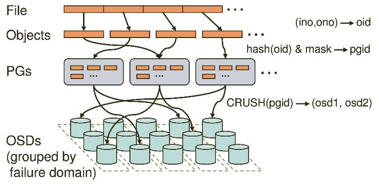

# Ceph知识总结


Ceph基于rados提供了无限可扩展的存储集群，集群主要包括两种类型的后台进程osd和mon，monitor主要负责维护cluster map，
osd会检测自己和邻居的状态，并上报给monitor。

典型的RADOS部署架构由少量的Monitor监控器以及大量的OSD存储设备组成，它能够在动态变化的基于异质结构的存储设备集群之上提
供一种稳定的、可扩展的、高性能的单一逻辑对象存储接口。RADOS系统的架构如图所示：


## Ceph集群图：

Monitor map: mon节点信息，包括ceph集群id，监视器主机名，ip地址和端口号，从创建mon至今的epoch信息和修改的时间

OSD map: 保存集群id，osd的创建和修改日期，还有跟池关联的一些信息，比如池的名称，ID，类型，副本级别和PG。

PG map: 保存pg版本，时间戳，最后的OSD map的版本，full ratio，near full ratio。它还保存每个pg的id，
对象数，状态，状态时间戳，up和acting的OSD集合，数据清洗详情。

CRUSH map: 保存集群中有关设备，桶，故障域等级和存储数据的规则集。

MDS map: 保存当前map的版本，map创建和修改的时间，数据和元数据池的ID，集群的MDS数量和MDS状态。

## Ceph基础组件：

Object：Ceph最底层的存储单元是Object对象，每个Object包含元数据和原始数据。

OSD：承担数据IO，数据恢复工作并负责响应客户端请求返回具体数据的进程

PG：是一个逻辑概念，一个pg包含多个osd，引入pg是为了更好的分配和定位数据

MON：用来保存OSD的元数据

CRUSH: Ceph使用的数据分布算法，类似一致性哈希，让数据分配到预期的地方

RBD: RADOS block device，是Ceph对外提供的块设备服务

RGW: RADOS gateway，是Ceph对外提供的对象存储服务，接口与S3和Swift兼容

MDS: Ceph Metadata Server，是CephFS服务依赖的元数据服务

libradio: 上层的RBD、RGW和CephFS都是通过librados访问的，目前提供PHP、Ruby、Java、Python、C和C++支持

librbd: ceph的块存储库，利用Rados提供的API实现对块设备的管理和操作

## Ceph的寻址及数据操作流程

### 寻址机制

Ceph系统中的寻址流程如下图所示：



上图中左侧的几个概念说明如下：

File：用户需要存储或者访问的文件。对于一个基于Ceph开发的对象存储应用而言，这个file也就对应于应用中的“对象”，
也就是用户直接操作的“对象”。

Ojbect：此处的object是RADOS所看到的“对象”。Object与上面提到的file的区别是，object的最大size由RADOS限定（通
常为2MB或4MB），以便实现底层存储的组织管理。因此，当上层应用向RADOS存入size很大的file时，需要将file切分成统一大小的
一系列object（最后一个的大小可以不同）进行存储。

PG(Placement Group): 上面已经简单介绍过了PG，PG的用途是对object的存储进行组织和位置映射。具体而言，一个PG负责
组织若干个object（可以为数千个甚至更多），但一个object只能被映射到一个PG中，即，PG和object之间是“一对多”映射关系。
同时，一个PG会被映射到n个OSD上，而每个OSD上都会承载大量的PG，即，PG和OSD之间是“多对多”映射关系。在实践当中，n至少为2，
如果用于生产环境，则至少为3。一个OSD上的PG则可达到数百个。事实上，PG数量的设置牵扯到数据分布的均匀性问题。

OSD：上文也已经简单提到，需要说明的是，OSD的数量事实上也关系到系统的数据分布均匀性，因此其数量不应太少。

故障域：指任何导致不能访问一个或多个OSD的故障，可以是主机上停止的进程、硬盘故障、操作系统崩溃、有问题的网卡、损坏的
电源、断网、断点等等。规划硬件需求时，要在多个需求间寻求平衡点，像付出很多努力减少故障域带来的成本削减、隔离每个潜在故障
域增加的成本。

基于上述定义，下面介绍下寻址流程。具体而言，ceph中的寻址至少要经历一下三次映射：

(1) File->Object

这次映射的目的是，经用户要操作的File，映射为Rados能够处理的Object。其映射十分简单，本质上就是按照Object的最大大小对File
进行切分。这种切分的好处有二，一是让大小不限的file变成最大size一致、可以被Rados高效管理的Object；二是让对单一file实施
的串行处理变为对多个object实施的并行化处理。每一个切分后产生的object将获得唯一的oid，即object id。其产生方式也是线性映射，
极其简单。图中，ino是待操作file的元数据，可以简单理解为该file的唯一id。ono则是由该file切分产生的某个object的序号。而oid
就是将这个序号简单连缀在该file id之后得到的。举例而言，如果一个id为filename的file被切分成了三个object，则其object序号
依次为0、1和2，而最终得到的oid就依次为filename0、filename1和filename2。

ino的唯一性必须得到保证，后则后续的映射无法正确进行。

(2) Object->PG

在File被映射为一个或多个Object以后，就需要将每个Object独立地映射到一个PG中去。这个映射也很简单，如图中所示，其计算公式是：

```cpp
hash(oid) & mask -> pgid
```

其计算由两步组成。首先是使用Ceph系统指定的一个静态哈希函数计算oid的哈希值，将oid映射成为一个近似均匀分布的伪随机值。然后，
将这个伪随机值和mask按位相与，得到最终的PG序号（pgid）。根据RADOS的设计，给定PG的总数为m（m应该为2的整数幂），则mask的
值为m-1。因此，哈希值计算和按位与操作的整体结果事实上是从所有m个PG中近似均匀地随机选择一个。基于这一机制，当有大量object
和大量PG时，RADOS能够保证object和PG之间的近似均匀映射。又因为object是由file切分而来，大部分object的size相同，因而，
这一映射最终保证了，各个PG中存储的object的总数据量近似均匀。

从介绍不难看出，这里反复强调了“大量”。只有当object和PG的数量较多时，这种伪随机关系的近似均匀性才能成立，Ceph的数据存储均
匀性才有保证。为保证“大量”的成立，一方面，object的最大size应该被合理配置，以使得同样数量的file能够被切分成更多的object；
另一方面，Ceph也推荐PG总数应该为OSD总数的数百倍，以保证有足够数量的PG可供映射。

(3) PG->OSD

第三次映射就是将作为object的逻辑组织单元的PG映射到数据的实际存储单元OSD。如图所示，RADOS采用一个名为CRUSH的算法，将pgid
代入其中，然后得到一组共n个OSD。这n个OSD即共同负责存储和维护一个PG中的所有object。前已述及，n的数值可以根据实际应用中
对于可靠性的需求而配置，在生产环境下通常为3。具体到每个OSD，则由其上运行的OSD deamon负责执行映射到本地的object在本地
文件系统中的存储、访问、元数据维护等操作。

和“object -> PG”映射中采用的哈希算法不同，这个CRUSH算法的结果不是绝对不变的，而是受到其他因素的影响。其影响因素主要有二：

一是当前系统状态，也就是上文逻辑结构中曾经提及的cluster map。当系统中的OSD状态、数量发生变化时，cluster map可能发生
变化，而这种变化将会影响到PG与OSD之间的映射。

二是存储策略配置。这里的策略主要与安全相关。利用策略配置，系统管理员可以指定承载同一个PG的3个OSD分别位于数据中心的不同
服务器乃至机架上，从而进一步改善存储的可靠性。

因此，只有在系统状态（cluster map）和存储策略都不发生变化的时候，PG和OSD之间的映射关系才是固定不变的。在实际使用当中，
策略一经配置通常不会改变。而系统状态的改变或者是由于设备损坏，或者是因为存储集群规模扩大。好在Ceph本身提供了对于这种变
化的自动化支持，因而，即便PG与OSD之间的映射关系发生了变化，也并不会对应用造成困扰。事实上，Ceph正是需要有目的的利用这
种动态映射关系。正是利用了CRUSH的动态特性，Ceph可以将一个PG根据需要动态迁移到不同的OSD组合上，从而自动化地实现高可靠
性、数据分布re-blancing等特性。

之所以在此次映射中使用CRUSH算法，而不是其他哈希算法，原因之一正是CRUSH具有上述可配置特性，可以根据管理员的配置参数决定
OSD的物理位置映射策略；另一方面是因为CRUSH具有特殊的“稳定性”，也即，当系统中加入新的OSD，导致系统规模增大时，大部分PG
与OSD之间的映射关系不会发生改变，只有少部分PG的映射关系会发生变化并引发数据迁移。这种可配置性和稳定性都不是普通哈希算法
所能提供的。因此，CRUSH算法的设计也是Ceph的核心内容之一，具体介绍可以参考。

至此为止，Ceph通过三次映射，完成了从file到object、PG和OSD整个映射过程。通观整个过程，可以看到，这里没有任何的全局性查
表操作需求。至于唯一的全局性数据结构cluster map，它的维护和操作都是轻量级的，不会对系统的可扩展性、性能等因素造成不良影响。


从上可以看出，引入PG的好处至少有二：一方面实现了object和OSD之间的动态映射，从而为Ceph的可靠性、自动化等特性的实现留下
了空间；另一方面也有效简化了数据的存储组织，大大降低了系统的维护管理开销。理解这一点，对于彻底理解Ceph的对象寻址机制，是
十分重要的。

### 数据操作流程

此处将首先以file写入过程为例，对数据操作流程进行说明。

为简化说明，便于理解，此处进行若干假定。这里假定待写入的file较小，无需切分，仅被映射为一个object。其次，假定系统中一个
PG被映射到3个OSD上。

基于上述假定，则file写入流程可以被下图表示：


如图所示，当某个client需要向Ceph集群写入一个file时，首先需要在本地完成上述的寻址流程，将file变为一个object，然后找出
存储该object的一组三个OSD。这三个OSD具有各自不同的序号，序号最靠前的那个OSD就是这一组中的Primary OSD，而后两个则依次
是Secondary OSD和Tertiary OSD。

找出三个OSD后，client将直接和Primary OSD通信，发起写入操作（步骤1）。Primary OSD收到请求后，分别向Secondary OSD
和Tertiary OSD发起写入操作（步骤2、3）。当Secondary OSD和Tertiary OSD各自完成写入操作后，将分别向Primary OSD
发送确认信息（步骤4、5）。当Primary OSD确信其他两个OSD的写入完成后，则自己也完成数据写入，并向client确认object写入
操作完成（步骤6）。

之所以采用这样的写入流程，本质上是为了保证写入过程中的可靠性，尽可能避免造成数据丢失。同时，由于client只需要向Primary 
OSD发送数据，因此，在Internet使用场景下的外网带宽和整体访问延迟又得到了一定程度的优化。

当然，这种可靠性机制必然导致较长的延迟，特别是，如果等到所有的OSD都将数据写入磁盘后再向client发送确认信号，则整体延迟可
能难以忍受。因此，Ceph可以分两次向client进行确认。当各个OSD都将数据写入内存缓冲区后，就先向client发送一次确认，此时
client即可以向下执行。待各个OSD都将数据写入磁盘后，会向client发送一个最终确认信号，此时client可以根据需要删除本地数据。

分析上述流程可以看出，在正常情况下，client可以独立完成OSD寻址操作，而不必依赖于其他系统模块。因此，大量的client可以同
时和大量的OSD进行并行操作。同时，如果一个file被切分成多个object，这多个object也可被并行发送至多个OSD。

从OSD的角度来看，由于同一个OSD在不同的PG中的角色不同，因此，其工作压力也可以被尽可能均匀地分担，从而避免单个OSD变成性能瓶颈。

如果需要读取数据，client只需完成同样的寻址过程，并直接和Primary OSD联系。目前的Ceph设计中，被读取的数据仅由Primary OSD
提供。但目前也有分散读取压力以提高性能的讨论。

### 集群维护

前面的介绍中已经提到，由若干个monitor共同负责整个Ceph集群中所有OSD状态的发现与记录，并且共同形成cluster map的master
版本，然后扩散至全体OSD以及client。OSD使用cluster map进行数据的维护，而client使用cluster map进行数据的寻址。

在集群中，各个monitor的功能总体上是一样的，其相互间的关系可以被简单理解为主从备份关系。因此，在下面的讨论中不对各个monitor
加以区分。

略显出乎意料的是，monitor并不主动轮询各个OSD的当前状态。正相反，OSD需要向monitor上报状态信息。常见的上报有两种情况：
一是新的OSD被加入集群，二是某个OSD发现自身或者其他OSD发生异常。在收到这些上报信息后，monitor将更新cluster map信息并
加以扩散。其细节将在下文中加以介绍。

Cluster map的实际内容包括：

(1) Epoch，即版本号。
Cluster map的epoch是一个单调递增序列。Epoch越大，则cluster map版本越新。因此，持有不同版本
cluster map的OSD或client可以简单地通过比较epoch决定应该遵从谁手中的版本。而monitor手中必定有epoch最大、版本最新的
cluster map。当任意两方在通信时发现彼此epoch值不同时，将默认先将cluster map同步至高版本一方的状态，再进行后续操作。

(2) 各个OSD的网络地址。

(3) 各个OSD的状态。
OSD状态的描述分为两个维度：up或者down（表明OSD是否正常工作），in或者out（表明OSD是否在至少一个PG中）。因此，对于任意
一个OSD，共有四种可能的状态：

Up且in：说明该OSD正常运行，且已经承载至少一个PG的数据。这是一个OSD的标准工作状态；

Up且out：说明该OSD正常运行，但并未承载任何PG，其中也没有数据。一个新的OSD刚刚被加入Ceph集群后，便会处于这一状态。
而一个出现故障的OSD被修复后，重新加入Ceph集群时，也是处于这一状态；

Down且in：说明该OSD发生异常，但仍然承载着至少一个PG，其中仍然存储着数据。这种状态下的OSD刚刚被发现存在异常，可能仍能
恢复正常，也可能会彻底无法工作；

Down且out：说明该OSD已经彻底发生故障，且已经不再承载任何PG。

(4) CRUSH算法配置参数。表明了Ceph集群的物理层级关系（cluster hierarchy），位置映射规则（placement rules）。

根据cluster map的定义可以看出，其版本变化通常只会由（3）和（4）两项信息的变化触发。而这两者相比，（3）发生变化的概率更
高一些。这可以通过下面对OSD工作状态变化过程的介绍加以反映。

一个新的OSD上线后，首先根据配置信息与monitor通信。Monitor将其加入cluster map，并设置为up且out状态，再将最新版本的
cluster map发给这个新OSD。

收到monitor发来的cluster map之后，这个新OSD计算出自己所承载的PG（为简化讨论，此处我们假定这个新的OSD开始只承载一个PG），
以及和自己承载同一个PG的其他OSD。然后，新OSD将与这些OSD取得联系。如果这个PG目前处于降级状态（即承载该PG的OSD个数少于正
常值，如正常应该是3个，此时只有2个或1个。这种情况通常是OSD故障所致），则其他OSD将把这个PG内的所有对象和元数据复制给新
OSD。数据复制完成后，新OSD被置为up且in状态。而cluster map内容也将据此更新。这事实上是一个自动化的failure recovery
过程。当然，即便没有新的OSD加入，降级的PG也将计算出其他OSD实现failure recovery。

如果该PG目前一切正常，则这个新OSD将替换掉现有OSD中的一个（PG内将重新选出Primary OSD），并承担其数据。在数据复制完成后，
新OSD被置为up且in状态，而被替换的OSD将退出该PG（但状态通常仍然为up且in，因为还要承载其他PG）。而cluster map内容也将
据此更新。这事实上是一个自动化的数据re-balancing过程。

如果一个OSD发现和自己共同承载一个PG的另一个OSD无法联通，则会将这一情况上报monitor。此外，如果一个OSD deamon发现自身
工作状态异常，也将把异常情况主动上报给monitor。在上述情况下，monitor将把出现问题的OSD的状态设为down且in。如果超过某
一预订时间期限，该OSD仍然无法恢复正常，则其状态将被设置为down且out。反之，如果该OSD能够恢复正常，则其状态会恢复为up且
in。在上述这些状态变化发生之后，monitor都将更新cluster map并进行扩散。这事实上是自动化的failure detection过程。

由之前介绍可以看出，对于一个Ceph集群而言，即便由数千个甚至更多OSD组成，cluster map的数据结构大小也并不惊人。同时，
cluster map的状态更新并不会频繁发生。即便如此，Ceph依然对cluster map信息的扩散机制进行了优化，以便减轻相关计算和通
信压力。

首先，cluster map信息是以增量形式扩散的。如果任意一次通信的双方发现其epoch不一致，则版本更新的一方将把二者所拥有的
cluster map的差异发送给另外一方。

其次，cluster map信息是以异步且lazy的形式扩散的。也即，monitor并不会在每一次cluster map版本更新后都将新版本广播至
全体OSD，而是在有OSD向自己上报信息时，将更新回复给对方。类似的，各个OSD也是在和其他OSD通信时，将更新发送给版本低于自己的对方。

基于上述机制，Ceph避免了由于cluster map版本更新而引起的广播风暴。这虽然是一种异步且lazy的机制，但根据Sage论文中的结论，
对于一个由n个OSD组成的Ceph集群，任何一次版本更新能够在O(log(n))时间复杂度内扩散到集群中的任何一个OSD上。

一个可能被问到的问题是：既然这是一种异步和lazy的扩散机制，则在版本扩散过程中，系统必定出现各个OSD看到的cluster map不
一致的情况，这是否会导致问题？答案是：不会。事实上，如果一个client和它要访问的PG内部的各个OSD看到的cluster map状态一致，
则访问操作就可以正确进行。而如果这个client或者PG中的某个OSD和其他几方的cluster map不一致，则根据Ceph的机制设计，
这几方将首先同步cluster map至最新状态，并进行必要的数据re-balancing操作，然后即可继续正常访问。

通过上述介绍，我们可以简要了解Ceph究竟是如果基于cluster map机制，并由monitor、OSD和client共同配合完成集群状态的维护
与数据访问的。特别的，基于这个机制，事实上可以自然而然的完成自动化的数据备份、数据re-balancing、故障探测和故障恢复，并
不需要复杂的特殊设计。这一点确实让人印象深刻。


## Ceph模块间的关系


### MSG:

上图中的MSG指的是Messenger类的实例，在OSD中使用的是其子类SimpleMessenger，其继承关系如下：


#### 启动Messenger

这里以ceph的osd服务为例来介绍Messenger，源码为`ceph_osd.cc`

(1) 启动Messenger对象，总共有如下几个Messenger会被创建:

* ms_public

* ms_cluster

* ms_hbclient

* `ms_hb_back_server`

* `ms_hb_front_server`

* ms_objecter

创建这些实例的时候，基类Messenger调用create方法，根据配置的`ms_type`类型来实例化具体的Messenger对象，目前的Messenger
有三种不同的实现：
SimpleMessenger, AsyncMessenger和XioMessenger

SimpleMessenger: 相对比较简单，目前可以在生产环境中使用的模式。它最大的特点是，每一个连接，都创建两个线程，
一个专门用于接收，一个专门用于发送

AsyncMessenger: 使用了基于事件IO的多路复用模式，这是比较通用的方式，没有用第三方库，实现起来比较复杂，目前还
处于试验阶段 ，ceph源码中基于epoll来实现，有助于减少集群中网络通信所需要的线程数，目前虽然不是默认的通信组件，
但是以后一定会取代SimpleMessenger

XioMessenger: 使用了开源的网络通信模块accelio来实现，依赖第三方库，实现起来较简单，但需要熟悉accelio的使用
方式，目前也处于试验阶段

默认的`ms_type`类型为"simple"

(2) 设置Messenger的协议为CEPH_OSD_PROTOCOL

```cpp
set_cluster_protocol(CEPH_OSD_PROTOCOL);
```

(3) 设置两个throttler(流量控制器)，分别用于限制OSD在网络层接受client请求的消息大小和消息数量，默认为500M和100

```cpp
boost::scoped_ptr<Throttle> client_byte_throttler(new Throttle(g_ceph_context, "osd_client_bytes", g_conf->osd_client_message_size_cap));
boost::scoped_ptr<Throttle> client_msg_throttler( new Throttle(g_ceph_context, "osd_client_messages", g_conf->osd_client_message_cap));
```

(4) 设置OSD服务支持的特性

(5) 设置每个Messenger的policy

(6) 绑定地址

`ms_public`绑定到`g_conf->public_addr`上

`ms_cluster`绑定到`g_cong->cluster_addr`上

`ms_hb_back_server`绑定到`g_conf->hb_back_addr`上

`ms_hb_front_server`绑定到`g_conf->hb_front_addr`上


#### Messenger的作用


从上可以看出，对于OSD服务而言，启动了多个Messenger监听器，每个监听器的作用如下，其中OSD节点会监听
public、cluster、front和back四个端口。

* public监听来自Monitor和Client的连接

* cluster监听处理来自OSD peer的连接

* 另外，OSD单独创建了一个名为hbclient的Messenger，作为心跳的客户端，单独用来建立连接发送心跳报文，心跳
优先发送给back连接


#### 消息分发方式


总体上，Ceph的消息处理框架是发布者订阅者的设计结构。Messenger担当发布者的角色，Dispatcher担当订阅者的角色。Messenger
将接收到的消息通知给已注册的Dispatcher，由Dispatcher完成具体的消息处理。

在服务端，SimpleMessenger通过Accepter实例监听端口，接收来自客户端的连接。Accepter接受客户端的连接后，为该连接创建一
个Pipe实例。

Pipe实例负责具体消息的接收和发送，一个Pipe实例包含一个读线程和一个写线程。读线程读取到消息后，有三种分发消息的方法：

(1) 快速分发，直接在Pipe的读线程中处理掉消息。可快速分发的消息在Dispatcher的ms_can_fast_dispatch中注册。

(2) 正常分发，将消息放入DispatchQueue，由单独的线程按照消息的优先级从高到低进行分发处理。需要注意的是，属于同一个
SimpleMessenger实例的Pipe间使用同个DispatchQueue。

(3) 延迟分发，为消息随机设置延迟时间，定时时间到时由单独的线程走快速分发或正常分发的流程分发消息。
Pipe的写线程将消息放入out_q队列，按照消息的优先级从高到低发送消息。另外，消息(Message)中携带了seq序列号，Pipe使用
`in_seq`和out_seq记录它接收到和发送出去的消息的序列号。发送消息时，Pipe用out_seq设置消息的序列号；接收消息时，通过比
较消息的序列号和`in_seq`来确定消息是否为旧消息，如果为旧消息则丢弃，否则使用消息的序列号更新in_seq。

## RBD

Ceph的块存储有两种使用途径，一种是利用librbd，另一种是使用内核模块。第一种主要为虚拟机提供块存储设备，第二种主要为
Host提供块设备支持，这两种途径的接口实现完全不同。librbd在ceph源码里已经提供，而且更稳定，也是ceph应用场景最广泛的。


kvm虚拟机使用rbd设备：

定义如下xml文件：

```sh
rbd_device.xml

<disk type='network' device='disk'>
  <driver name='qemu' type='raw' cache='writeback'/>
  <auth username='admin'>
    <secret type='ceph' uuid='e403fe43-3e9e-473b-9853-44ea881489d2'/>
  </auth>
  <source protocol='rbd' name='sata/test'>
    <host name='192.168.104.11' port='6789'/>
    <host name='192.168.104.12' port='6789'/>
    <host name='192.168.104.13' port='6789'/>
    <!--<snapshot name='snapname'/>-->
    <!--<config file='/path/to/file'/>-->
  </source>
  <target dev='vdc' bus='virtio'/>
  <!--<iotune>-->
    <!--<read_bytes_sec>209715200</read_bytes_sec>-->
    <!--<write_bytes_sec>167772160</write_bytes_sec>-->
    <!--<read_iops_sec>80</read_iops_sec>-->
    <!--<write_iops_sec>40</write_iops_sec>-->
    <!--</iotune>-->
  <alias name='virtio-disk0'/>
  <address type='pci' domain='0x0000' but='0x00' slot='0x07' function='0x0'/>
</disk>
```

使用`virsh attah-device <domain_id> rbd_device.xml`将ceph的rbd镜像附加到虚拟机里，在虚拟机里对应的设备为/dev/vdx

## PG

### PG状态及变迁

**Creating:**

创建存储池时,它会创建指定数量的归置组。ceph 在创建一或多个归置组时会显示creating;创建完后,在其归置组的 Acting Set
里的 OSD 将建立互联;一旦互联完成,归置组状态应该变为active+clean,意思是ceph客户端可以向归置组写入数据了。

**Peering:**

ceph为归置组建立互联时,会让存储归置组副本的OSD之间就其中的对象和元数据状态达成一致。ceph 完成了互联,也就意味着存储
着归置组的OSD就其当前状态达成了一致。然而,互联过程的完成并不能表明各副本都有了数据的最新版本。

**Active:**

ceph 完成互联进程后,一归置组就可变为 active。active 状态通常意味着在主归置组和副本中的数据都可以读写。

**Clean:**

某一归置组处于 clean 状态时,主 OSD 和副本 OSD 已成功互联,并且没有偏离的归置组。ceph 已把归置组中的对象复制了规定次数。

**Degraded:**

当客户端向主 OSD 写入数据时,由主 OSD 负责把副本写入其余复制 OSD。主 OSD 把对象写入复制 OSD 后,在没收到成功完成的确
认前,主 OSD 会一直停留在 degraded 状态。归置组状态可以是 active+degraded 状态,原因在于一 OSD 即使没所有对象也可
以处于 active 状态。如果一OSD 挂了,ceph 会把相关的归置组都标记为 degraded;那个 OSD 重生后,它们必须重新互联。然而,
如果归置组仍处于 active 状态,即便它处于 degraded 状态,客户端还可以向其写入新对象。如果一 OSD 挂了,且 degraded 状
态持续,ceph 会把 down 的 OSD 标记为在集群外(out)、并把那些 down 掉的 OSD 上的数据重映射到其它 OSD。从标记为down
到 out 的时间间隔由 mon osd down out interval 控制,默认是 300 秒。
归置组也会被降级(degraded),因为归置组找不到本应存在于归置组中的一或多个对象,这时,你不能读或写找不到的对象,但仍能访问其
它位于降级归置组中的对象。

**Recovering:**

ceph 被设计为可容错,可抵御一定规模的软、硬件问题。当某 OSD 挂了(down)时,其内容版本会落后于归置组内的其它副本;它重生
(up)时,归置组内容必须更新,以反映当前状态;在此期间,OSD 在recovering 状态。恢复并非总是这些小事,因为一次硬件失败可能
牵连多个 OSD。比如一个机柜的网络交换机失败了,这会导致多个主机落后于集群的当前状态,问题解决后每一个 OSD 都必须恢复。
ceph 提供了很多选项来均衡资源竞争,如新服务请求、恢复数据对象和恢复归置组到当前状态。osd recovery delay start选项允
许一 OSD 在开始恢复进程前,先重启、重建互联、甚至处理一些重放请求;osd recovery threads 选项限制恢复进程的线程数,默认
为1线程;
osd recovery thread timeout 设置线程超时,因为多个OSD 可能交替失败、重启和重建互联;
osd recovery max active 选项限制一 OSD 最多同时接受多少请求,以防它压力过大而不能正常服务;
osd recovery max chunk 选项限制恢复数据块尺寸,以防网络拥塞。

**Back Filling:**

有新 OSD 加入集群时,CRUSH 会把现有集群内的归置组重分配给它。强制新 OSD 立即接受重分配的归置组会使之过载,用归置组回填
可使这个过程在后台开始。回填完成后,新 OSD 准备好时就可以对外服务了。

**Remapped:**

某一PG的Acting Set变更时,数据要从旧集合迁移到新的。主OSD要花费一些时间才能提供服务,所以它可以让老的主OSD持续服务，直
到归置组迁移完。数据迁移完后,主OSD会映射到新的acting set。

**Stale:**

虽然 ceph 用心跳来保证主机和守护进程在运行,但是 ceph-osd 仍有可能进入 stuck 状态,它们没有按时报告其状态(如网络瞬断)。
默认,OSD 守护进程每半秒(0.5)会一次报告其归置组、出流量、引导和失败统计状态,此频率高于心跳阀值。如果一归置组的主OSD所在
的 acting set 没能向监视器报告、或者其它监视器已经报告了那个主 OSD 已 down,监视器们就会把此归置组标记为stale。启动
集群时,会经常看到 stale 状态,直到互联完成。集群运行一阵后,如果还能看到有归置组位于 stale 状态,就说明那些归置组的主
OSD 挂了(down)、或没在向监视器报告统计信息。

### Peering过程

#### Peering的作用

Ceph用多副本来保证数据可靠性，一般设置为2或3个副本，每个pg，通过peering来使它的多个副本达到一致的状态。


#### 一些相关的概念

(1) Acting set：负责这个pg的所有osd的集合

(2) Epoch：osdmap的版本号，单调递增，osdmap每变化一次，版本号加1

(3) Past interval：一个epoch序列，在这个序列内，这个pg的acting set没有变化过

(4) Last epoch start：上一次peering完成的epoch

(5) up_thru：一个past interval内，第一次完成peering的epoch

#### Peering的触发时机

OSD启动时，osd负责的所有pg，会触发peering；负责pg的osd状态发生变化时，会触发peering。

#### Peering的流程

pg的副本有主从的角色，主负责协调整个peering过程，大致流程如下：

(1) 生成past interval序列

在每次osd map发生变化时，如果本pg的acting set有变化，则生成新的past interval，同时记录下上次的past interval

(2) 选择需要参与peering的osd

(3) 选取权威osd

(4) Merge权威osd的log到primary

* 将缺失的log entry merge到本地的pg log

* 将merge的log entry对应的oid，填充到missing结构中

(5) 对比修复各个副本的pg log

* 确定缺失的log区间

* 在稍后的activate函数中，将缺失的log发送到副本，同时将发送的log对应的oid填充到peer_missing结构中

### recovery过程

#### recovery的启动时机 

recovery是对已知的副本不一致或者副本数不足进行修复。以pg为单位进行操作。大概有三个启动时机：

* peering完成后

* scrub完成后

* 读写操作时，操作的oid处于missing状态，则先recovery这个object。

OSD维护了一个recovery_wq的线程池，用于执行所有pg的recovery。

#### peering后的recovery

peering在某个pg由degrade状态重新恢复到active状态后启动。通过对比pg的每个osd的pglog，得到osd缺少的oid。Primary缺
少的的放到pg\_log对象的missing结构中。Replica缺少的放到peer\_missing结构中。
Recovery就是修复missing和peer_missing中的oid。

TODO 

Replica修复和Primary修复流程图

TODO 

#### scrub后的recovery

scrub依据配置的时间间隔定时启动。通过对比pg的每个osd的所有object信息，得到osd缺少的oid。如果需要修复，则把primary
缺少oid的放到pg\_log对象的missing结构中。Replica缺少的放到peer_missing结构中。

Scrub后，会判断是否需要recovery。日常定时启动的scrub是不会进行recovery的。只有通过osd command执行repair命令，才
会先进行scrub，完成后进行recovery。

如果进行recovery，则流程同上。

这样不太好，应该scrub后立即修复。假设2副本，其中一副本坏了一块儿盘，scrub检测到了这些丢失的副本，但没有修复。
这些副本如果不被读写，或者很久没有peering，那这些副本将长期处于丢失状态。万一这段时间内，另外一份副本也出问
题了，就会数据丢失。

#### 读写操作前的Recovery

TODO 

## 参考

[librbd-块存储库](http://www.wzxue.com/ceph-librbd-block-library/)
