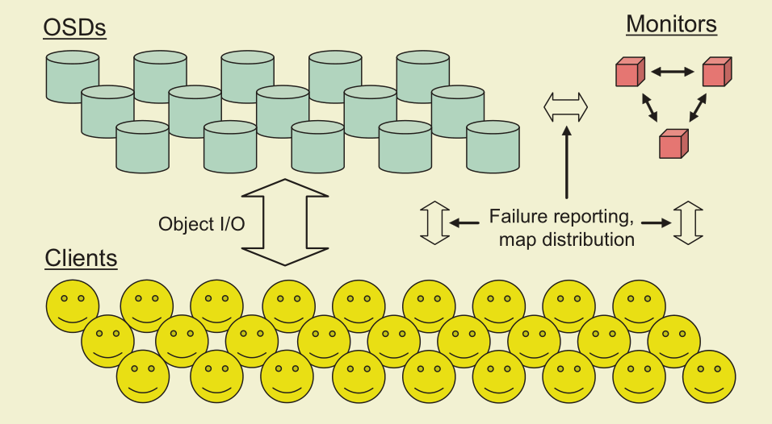
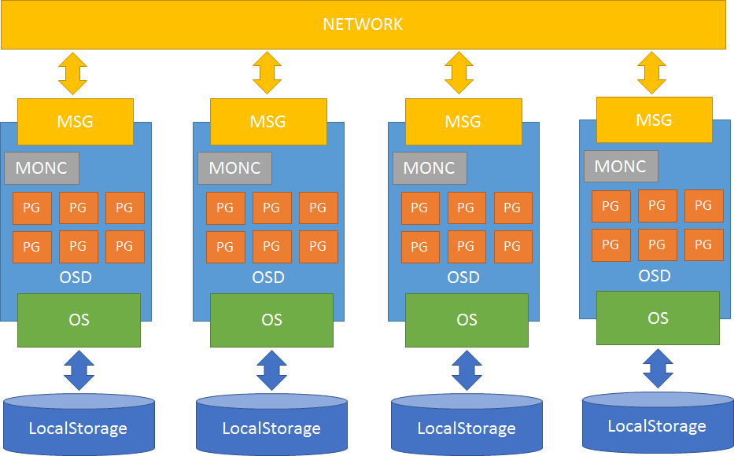
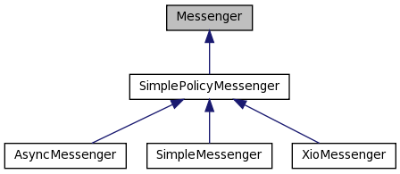
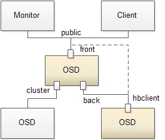
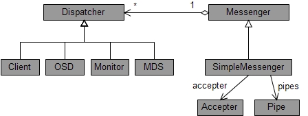
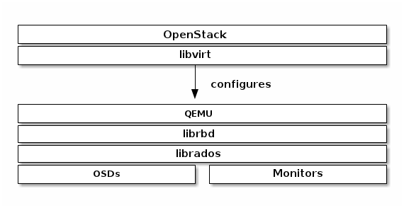
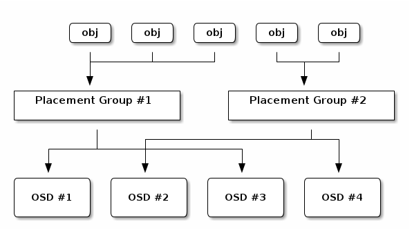
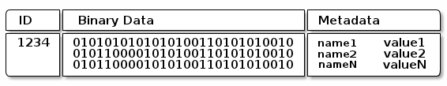

# Ceph知识总结

 

Ceph基于rados提供了无限可扩展的存储集群，集群主要包括两种类型的后台进程osd和mon，monitor主要负责维护cluster map，
osd会检测自己和邻居的状态，并上报给monitor。

典型的RADOS部署架构由少量的Monitor监控器以及大量的OSD存储设备组成，它能够在动态变化的基于异质结构的存储设备集群之上提
供一种稳定的、可扩展的、高性能的单一逻辑对象存储接口。RADOS系统的架构如图所示：

 

## Ceph集群图：

Monitor map: mon节点信息，包括ceph集群id，监视器主机名，ip地址和端口号，从创建mon至今的epoch信息和修改的时间

OSD map: 保存集群id，osd的创建和修改日期，还有跟池关联的一些信息，比如池的名称，ID，类型，副本级别和PG。

PG map: 保存pg版本，时间戳，最后的OSD map的版本，full ratio，near full ratio。它还保存每个pg的id，
对象数，状态，状态时间戳，up和acting的OSD集合，数据清洗详情。

CRUSH map: 保存集群中有关设备，桶，故障域等级和存储数据的规则集。

MDS map: 保存当前map的版本，map创建和修改的时间，数据和元数据池的ID，集群的MDS数量和MDS状态。

## Ceph基础组件：

Object：Ceph最底层的存储单元是Object对象，每个Object包含元数据和原始数据。

OSD：承担数据IO，数据恢复工作并负责响应客户端请求返回具体数据的进程

PG：是一个逻辑概念，一个pg包含多个osd，引入pg是为了更好的分配和定位数据

MON：用来保存OSD的元数据

CRUSH: Ceph使用的数据分布算法，类似一致性哈希，让数据分配到预期的地方

RBD: RADOS block device，是Ceph对外提供的块设备服务

RGW: RADOS gateway，是Ceph对外提供的对象存储服务，接口与S3和Swift兼容

MDS: Ceph Metadata Server，是CephFS服务依赖的元数据服务

libradio: 上层的RBD、RGW和CephFS都是通过librados访问的，目前提供PHP、Ruby、Java、Python、C和C++支持

librbd: ceph的块存储库，利用Rados提供的API实现对块设备的管理和操作

## Ceph模块间的关系




### MSG:

上图中的MSG指的是Messenger类的实例，在OSD中使用的是其子类SimpleMessenger，其继承关系如下：



#### 启动Messenger

这里以ceph的osd服务为例来介绍Messenger，源码为`ceph_osd.cc`

(1) 启动Messenger对象，总共有如下几个Messenger会被创建:

* ms_public

* ms_cluster

* ms_hbclient

* `ms_hb_back_server`

* `ms_hb_front_server`

* ms_objecter

创建这些实例的时候，基类Messenger调用create方法，根据配置的`ms_type`类型来实例化具体的Messenger对象，目前的Messenger
有三种不同的实现：
SimpleMessenger, AsyncMessenger和XioMessenger

SimpleMessenger: 相对比较简单，目前可以在生产环境中使用的模式。它最大的特点是，每一个连接，都创建两个线程，
一个专门用于接收，一个专门用于发送

AsyncMessenger: 使用了基于事件IO的多路复用模式，这是比较通用的方式，没有用第三方库，实现起来比较复杂，目前还
处于试验阶段 ，ceph源码中基于epoll来实现，有助于减少集群中网络通信所需要的线程数，目前虽然不是默认的通信组件，
但是以后一定会取代SimpleMessenger

XioMessenger: 使用了开源的网络通信模块accelio来实现，依赖第三方库，实现起来较简单，但需要熟悉accelio的使用
方式，目前也处于试验阶段

默认的`ms_type`类型为"simple"

(2) 设置Messenger的协议为CEPH_OSD_PROTOCOL

```cpp
set_cluster_protocol(CEPH_OSD_PROTOCOL);
```
(3) 设置两个throttler(流量控制器)，分别用于限制OSD在网络层接受client请求的消息大小和消息数量，默认为500M和100

```cpp
boost::scoped_ptr<Throttle> client_byte_throttler(new Throttle(g_ceph_context, "osd_client_bytes", g_conf->osd_client_message_size_cap));
boost::scoped_ptr<Throttle> client_msg_throttler( new Throttle(g_ceph_context, "osd_client_messages", g_conf->osd_client_message_cap));
```

(4) 设置OSD服务支持的特性

(5) 设置每个Messenger的policy

(6) 绑定地址

`ms_public`绑定到`g_conf->public_addr`上

`ms_cluster`绑定到`g_cong->cluster_addr`上

`ms_hb_back_server`绑定到`g_conf->hb_back_addr`上

`ms_hb_front_server`绑定到`g_conf->hb_front_addr`上


#### Messenger的作用



从上可以看出，对于OSD服务而言，启动了多个Messenger监听器，每个监听器的作用如下，其中OSD节点会监听
public、cluster、front和back四个端口。

* public监听来自Monitor和Client的连接

* cluster监听处理来自OSD peer的连接

* 另外，OSD单独创建了一个名为hbclient的Messenger，作为心跳的客户端，单独用来建立连接发送心跳报文，心跳
优先发送给back连接


#### 消息分发方式



总体上，Ceph的消息处理框架是发布者订阅者的设计结构。Messenger担当发布者的角色，Dispatcher担当订阅者的角色。Messenger
将接收到的消息通知给已注册的Dispatcher，由Dispatcher完成具体的消息处理。

在服务端，SimpleMessenger通过Accepter实例监听端口，接收来自客户端的连接。Accepter接受客户端的连接后，为该连接创建一
个Pipe实例。

Pipe实例负责具体消息的接收和发送，一个Pipe实例包含一个读线程和一个写线程。读线程读取到消息后，有三种分发消息的方法：

(1) 快速分发，直接在Pipe的读线程中处理掉消息。可快速分发的消息在Dispatcher的ms_can_fast_dispatch中注册。

(2) 正常分发，将消息放入DispatchQueue，由单独的线程按照消息的优先级从高到低进行分发处理。需要注意的是，属于同一个
SimpleMessenger实例的Pipe间使用同个DispatchQueue。

(3) 延迟分发，为消息随机设置延迟时间，定时时间到时由单独的线程走快速分发或正常分发的流程分发消息。
Pipe的写线程将消息放入out_q队列，按照消息的优先级从高到低发送消息。另外，消息(Message)中携带了seq序列号，Pipe使用
`in_seq`和out_seq记录它接收到和发送出去的消息的序列号。发送消息时，Pipe用out_seq设置消息的序列号；接收消息时，通过比
较消息的序列号和`in_seq`来确定消息是否为旧消息，如果为旧消息则丢弃，否则使用消息的序列号更新in_seq。


### MONC(Monitor Client):


### PG与OSD:


### OS(ObjectStore):


## RBD

Ceph的块存储有两种使用途径，一种是利用librbd，另一种是使用内核模块。第一种主要为虚拟机提供块存储设备，第二种主要为
Host提供块设备支持，这两种途径的接口实现完全不同。librbd在ceph源码里已经提供，而且更稳定，也是ceph应用场景最广泛的。



kvm虚拟机使用rbd设备：

定义如下xml文件：

```sh
rbd_device.xml

<disk type='network' device='disk'>                                                                                                                                       
  <driver name='qemu' type='raw' cache='writeback'/>                              
  <auth username='admin'>                                                         
    <secret type='ceph' uuid='e403fe43-3e9e-473b-9853-44ea881489d2'/>             
  </auth>                                                                         
  <source protocol='rbd' name='sata/test'>                                        
    <host name='192.168.104.11' port='6789'/>                                     
    <host name='192.168.104.12' port='6789'/>                                     
    <host name='192.168.104.13' port='6789'/>                                     
    <!--<snapshot name='snapname'/>-->                                            
    <!--<config file='/path/to/file'/>-->                                         
  </source>                                                                       
  <target dev='vdc' bus='virtio'/>                                                
  <!--<iotune>-->                                                                 
    <!--<read_bytes_sec>209715200</read_bytes_sec>-->                             
    <!--<write_bytes_sec>167772160</write_bytes_sec>-->                           
    <!--<read_iops_sec>80</read_iops_sec>-->                                      
    <!--<write_iops_sec>40</write_iops_sec>-->                                    
    <!--</iotune>-->                                                              
  <alias name='virtio-disk0'/>                                                    
  <address type='pci' domain='0x0000' but='0x00' slot='0x07' function='0x0'/>  
</disk>  
```

使用`virsh attah-device <domain_id> rbd_device.xml`将ceph的rbd镜像附加到虚拟机里，在虚拟机里对应的设备为/dev/vdx

## Ceph数据存储

Ceph存储集群从客户端接收文件，每个文件都会被客户端切分成一个或多个对象，然后将这些对象进行分组，再根据一定的策略存储
到集群的OSD节点中，其存储过程如图所示：



图中，对象的分发需要经过两个阶段的计算，才能得到存储该对象的OSD，然后将对象存储到OSD中对应的位置。

(1)  对象到PG的映射。PG(PlaccmentGroup)是对象的逻辑集合。PG是系统向OSD节点分发数据的基本单位，相同PG里的对象将被
分发到相同的OSD节点中(一个主OSD节点多个备份OSD节点)。对象的PG是由对象ID号通过Hash算法，结合其他一些修正参数得到的。

(2)  PG到相应的OSD的映射，RADOS系统利用相应的哈希算法根据系统当前的状态以及PG的ID号，将各个PG分发到OSD集群中。OSD集
群是根据物理节点的容错区域(比如机架、机房等)来进行划分的。

Ceph中的OSD节点将所有的对象存储在一个没有分层和目录的统一的命名空问中。每个对象都包含一个ID号、若干二进制数据以及相应的
元数据。ID号在整个存储集群中是唯一的；元数据标识了所存储数据的属性。一个对象在OSD节点中的存储方式大致如图所示:



而对存储数据的语义解释则交给相应的客户端来完成。

## PG

### PG状态

Creating:

创建存储池时,它会创建指定数量的归置组。ceph 在创建一或多个归置组时会显示 creating;创建完后,在其归置组的 Acting Set
里的 OSD 将建立互联;一旦互联完成,归置组状态应该变为 active+clean,意思是ceph 客户端可以向归置组写入数据了。

Peering:

ceph 为归置组建立互联时,会让存储归置组副本的 OSD 之间就其中的对象和元数据状态达成一致。ceph 完成了互联,也就意味着存储
着归置组的 OSD 就其当前状态达成了一致。然而,互联过程的完成并不能表明各副本都有了数据的最新版本。

Active:

ceph 完成互联进程后,一归置组就可变为 active。active 状态通常意味着在主归置组和副本中的数据都可以读写。

Clean:

某一归置组处于 clean 状态时,主 OSD 和副本 OSD 已成功互联,并且没有偏离的归置组。ceph 已把归置组中的对象复制了规定次数。

Degraded:

当客户端向主 OSD 写入数据时,由主 OSD 负责把副本写入其余复制 OSD。主 OSD 把对象写入复制 OSD 后,在没收到成功完成的确
认前,主 OSD 会一直停留在 degraded 状态。归置组状态可以是 active+degraded 状态,原因在于一 OSD 即使没所有对象也可
以处于 active 状态。如果一OSD 挂了,ceph 会把相关的归置组都标记为 degraded;那个 OSD 重生后,它们必须重新互联。然而,
如果归置组仍处于 active 状态,即便它处于 degraded 状态,客户端还可以向其写入新对象。如果一 OSD 挂了,且 degraded 状
态持续,ceph 会把 down 的 OSD 标记为在集群外(out)、并把那些 down 掉的 OSD 上的数据重映射到其它 OSD。从标记为down
到 out 的时间间隔由 mon osd down out interval 控制,默认是 300 秒。
归置组也会被降级(degraded),因为归置组找不到本应存在于归置组中的一或多个对象,这时,你不能读或写找不到的对象,但仍能访问其
它位于降级归置组中的对象。

Recovering:

ceph 被设计为可容错,可抵御一定规模的软、硬件问题。当某 OSD 挂了(down)时,其内容版本会落后于归置组内的其它副本;它重生
(up)时,归置组内容必须更新,以反映当前状态;在此期间,OSD 在recovering 状态。恢复并非总是这些小事,因为一次硬件失败可能
牵连多个 OSD。比如一个机柜的网络交换机失败了,这会导致多个主机落后于集群的当前状态,问题解决后每一个 OSD 都必须恢复。
ceph 提供了很多选项来均衡资源竞争,如新服务请求、恢复数据对象和恢复归置组到当前状态。osd recovery delay start选项允
许一 OSD 在开始恢复进程前,先重启、重建互联、甚至处理一些重放请求;osd recovery threads 选项限制恢复进程的线程数,默认
为1线程;
osd recovery thread timeout 设置线程超时,因为多个OSD 可能交替失败、重启和重建互联;
osd recovery max active 选项限制一 OSD 最多同时接受多少请求,以防它压力过大而不能正常服务;
osd recovery max chunk 选项限制恢复数据块尺寸,以防网络拥塞。

Back Filling:

有新 OSD 加入集群时,CRUSH 会把现有集群内的归置组重分配给它。强制新 OSD 立即接受重分配的归置组会使之过载,用归置组回填
可使这个过程在后台开始。回填完成后,新 OSD 准备好时就可以对外服务了。

Remapped:

某一归置组的 Acting Set 变更时,数据要从旧集合迁移到新的。主 OSD 要花费一些时间才能提供服务,所以它可以让老的主OSD持续
服务、直到归置组迁移完。数据迁移完后,主 OSD 会映射到新 acting set。

Stale:

虽然 ceph 用心跳来保证主机和守护进程在运行,但是 ceph-osd 仍有可能进入 stuck 状态,它们没有按时报告其状态(如网络瞬断)。
默认,OSD 守护进程每半秒(0.5)会一次报告其归置组、出流量、引导和失败统计状态,此频率高于心跳阀值。如果一归置组的主OSD所在
的 acting set 没能向监视器报告、或者其它监视器已经报告了那个主 OSD 已 down,监视器们就会把此归置组标记为stale。启动
集群时,会经常看到 stale 状态,直到互联完成。集群运行一阵后,如果还能看到有归置组位于 stale 状态,就说明那些归置组的主
OSD 挂了(down)、或没在向监视器报告统计信息。

### peering过程

peering的触发时机：

OSD启动时，osd负责的所有pg，会触发peering，负责pg的osd状态发生变化时，会触发peering。

peering的流程：

pg的副本有主从的角色，主负责协调整个peering过程，大致流程如下：

(1) 生成past interval序列


###  recovery过程

#### recovery的启动时机 

recovery是对已知的副本不一致或者副本数不足进行修复。以pg为单位进行操作。大概有三个启动时机：

(1) peering完成后

(2) scrub完成后

(3) 读写操作时，操作的oid处于missing状态，则先recovery这个object。

OSD维护了一个recovery_wq的线程池，用于执行所有pg的recovery。

#### peering后的recovery

peering在某个pg由degrade状态重新恢复到active状态后启动。通过对比pg的每个osd的pglog，得到osd缺少的oid。Primary缺
少的的放到pg\_log对象的missing结构中。Replica缺少的放到peer\_missing结构中。
Recovery就是修复missing和peer_missing中的oid。

#### scrub后的recovery

scrub依据配置的时间间隔定时启动。通过对比pg的每个osd的所有object信息，得到osd缺少的oid。如果需要修复，则把primary
缺少oid的放到pg\_log对象的missing结构中。Replica缺少的放到peer_missing结构中。

Scrub后，会判断是否需要recovery。日常定时启动的scrub是不会进行recovery的。只有通过osd command执行repair命令，才
会先进行scrub，完成后进行recovery。

如果进行recovery，则流程同上。

这样不太好，应该scrub后立即修复。假设2副本，其中一副本坏了一块儿盘，scrub检测到了这些丢失的副本，但没有修复。这些副本如果不被读写，或者很久没有peering，那这些副本将长期处于丢失状态。万一这段时间内，另外一份副本也出问题了，就会数据丢失。


