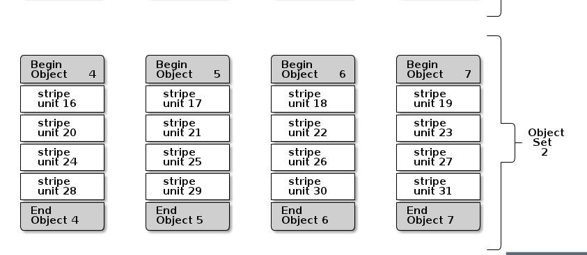

# Ceph学习计划

## 存储基础知识

## Ceph知识总结

### 条带化设置



如上图所示：

```paint
stripe_count = 4
```

(也可以表示为1个object set的大小)即并发可顺序写的thread，同时可向4个object写入，提高性能

```paint
stripe_unit = xxx
```

表示每次每块写入的最小单位

```sh
#102400M 大小 strip-unit 65535 byte strip-count 16
rbd create --image-format 2 disk1 --size 102400 --stripe-unit 65536 --stripe-count 16
```

[libradosstriper.cc](https://github.com/ceph/ceph/blob/giant/src/libradosstriper/libradosstriper.cc)